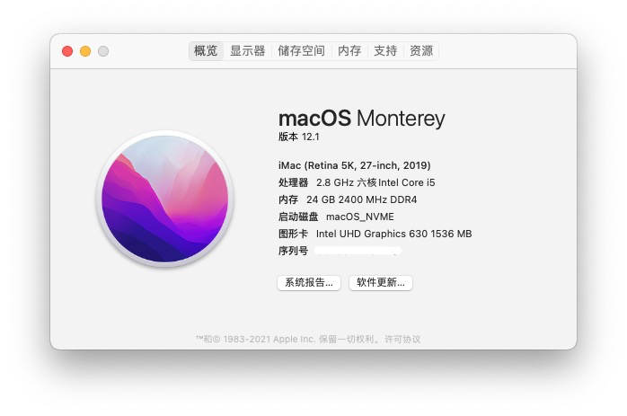

# Gigabyte-B360M-Aorus-Pro-Hackintosh-EFI
OpenCore EFI for Gigabyte B360M AORUS PRO

**Thanks to:**

[OpenCore 0.7.9](https://github.com/acidanthera/OpenCorePkg/releases/latest)

[macOS 12](https://www.apple.com/macos/monterey/)

**And my blog here**

[My Blog](https://ffffox.gitee.io/blog/)

## About

This EFI uses `iMac19,1` SMBIOS. Most of the Mac features are activated. The Service can be launched as well. 

> Most users of Gigabyte B360 series motherboard can probably use it through modification. 

> This EFI is only a personal build sharing, If you need a standard installation guide, please read the official documentation of OpenCore.

## Hardware List

|          Specs | Details                                                   | 
|---------------:|:----------------------------------------------------------|
|          Board |  Gigabyte® B360M AORUS PRO                                |
|            CPU | Intel® Core™ i5-8400 (with Intel UHD Graphics 630)        |
|         Memory | 8GB DDR4 2400MHz x 3                                      |
|            SSD | Samsung® 980 500GB                                        |
|  Graphics Card | AMD® RX 470 4GB                                           |
|  Wireless Card | Fenvi® FV-T919 (BCM94360CD 1750M + Bluetooth 4.0)         |

## What is Working
- [x] Sound Card (Onboard) / Network Card (Onboard)
- [x] Graphics Card (Integrated + Discrete) / Hardware Decoding 4K (HEVC + H.264)
- [x] AirDrop / Handoff / Sidecar (Wired)
- [x] FaceTime / iMessage
- [x] Sleep / Wake from Keyboard and Mouse

## What is NOT Working
- Sidecar (Wireless)
    > IDKY, but maybe my fenvi wireless network card is incompatible. If you guys have other network cards that is compatible, please let me know.   
- USB 3.0 interface is not compatible with USB 2.0 device.

*Tips：This EFI is not so suitable for installing macOS from zero, there might be a lot of unexplained problems during the installation process, I personally recommend you to use a hard drive with macOS already installed and use this EFI to boot into the system (It'll do a great job.).* 

## Donate me
||| 
|---------------:|:----------------------------------------------------------|
|    **微信**        |  **支付宝**                               |
